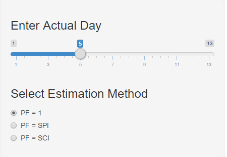

## Introduction

When implementing a project you always need to know where your project stands. 
Is it on schedule? On budget?

The application does exactly that. It uses a sample project and the users input to calculate basic project indexes that show how well the project is implemented and gives a prediction on when the project will be completed. 

My intetion is to extent the app so that the user can enter his project. 

The link to the application is: https://castor.shinyapps.io/Dev_Data_Prod_Course_prj

--- 

## Input

The application uses the planned value, the actual value and the earned value of the project. This data can easilly be extracted from any project scheduling software. (Here I use a sample project)

The user just inputs the current project's day, through the slider and chooses the method to be used for the estimation. 



--- 

## Output

The application calculates the basic indexes that show how the project is implemented in relation with it's planned schedule. 

- SPI(t) is and index that shows the current schedule performance. 
    - SPI(t) > 1 means that the project is ahead of schedule, 
    - SPI(t) < 1 means that the project is behind schedule and 
    - SPI(t) = 1 means that the project is on schedule

- CPI is and index that shows the current cost performance. 
    - CPI > 1 means that the project is under budget, 
    - CPI < 1 means that the project is over budget and 
    - CPI = 1 means that the project is on budget

- CSI(t) is a composite index for schedule and cost performance. It is the product of SPI(t) and CPI.

- EAC(t) Is the Estimation At Completion Time, i.e. the estimated duration of the project.

---

## Example

When the project is in it's 6th day and the estimation method is PF = CSI(t). ie:


```r
AD <- 5
```


```r
PF <- SPIt
```


Then: 
- SPI(t) equals 0.951
- CPI equals 1.039
- CSI(t) equals 0.988

And Estimation At Completion (EAC) equals 9.461 

-----------------------------
